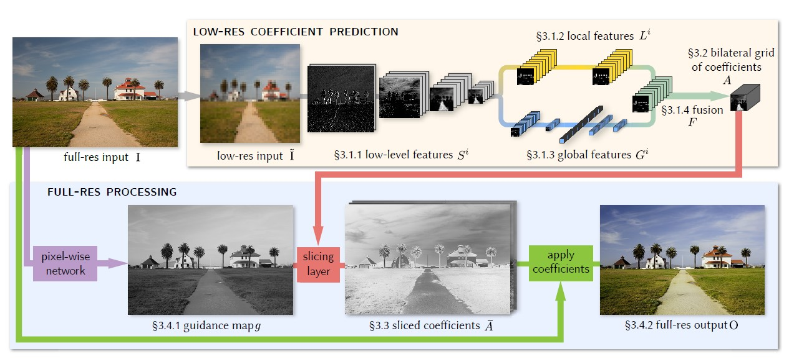
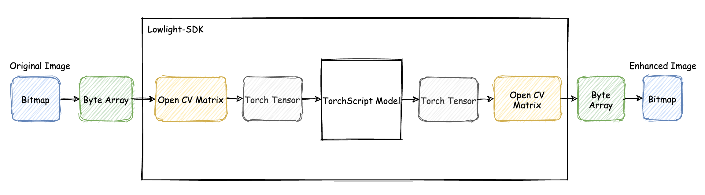
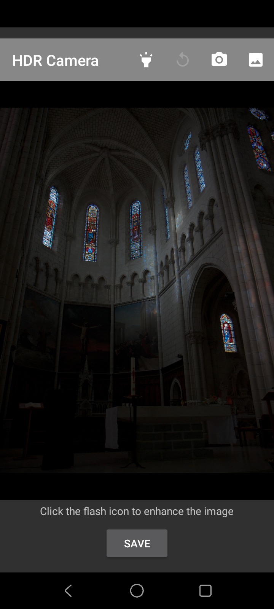
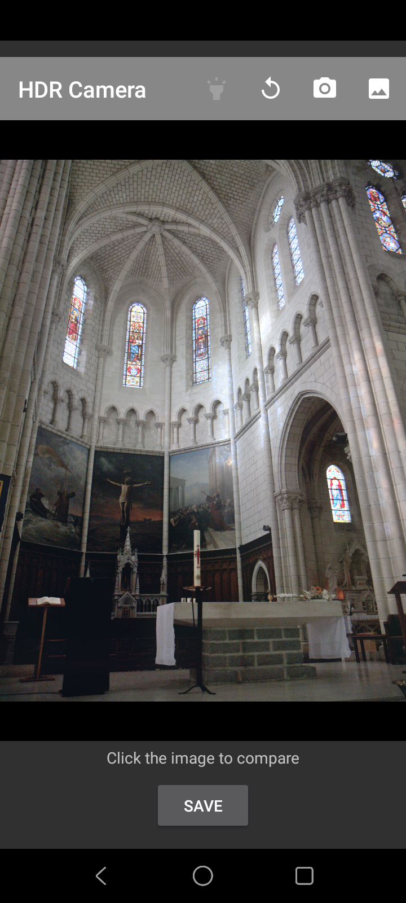
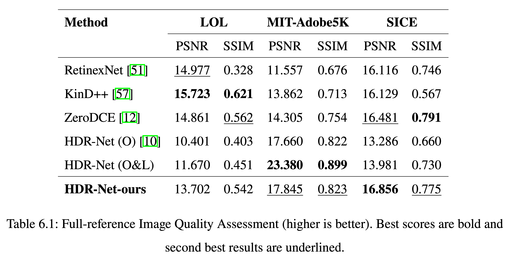
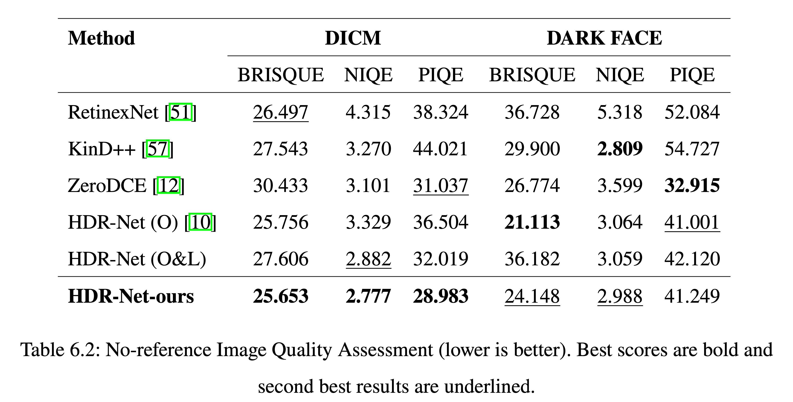

# Lowlight Image Enhancement

This is a repo for Android Application for Lowlight Image Enhancement.

## Introduction

### Enhancement method

The model architecture was adopted from [hdrnet](https://github.com/google/hdrnet), which ultilize the bilateral upsampling to speed up model inference time. See the below figure for the illustration of model architecture.



#### Modifications

- Loss functions: extra unsupervised loss functions are added in order to generalize the model.
- Dataset: model was retrained on the modified [MIT-Adobe5K Dataset](https://people.csail.mit.edu/vladb/photoadjust/db_imageadjust.pdf)

### Requirements

```
- Android studio
- SDK 29
- NDK 21
```

## Results

### Application architecture



### Application UI

|                     Before                      |                     After                      |
| :---------------------------------------------: | :--------------------------------------------: |
|  |  |

## Benchmark

### Comparing to other methods





### Samples visualization


